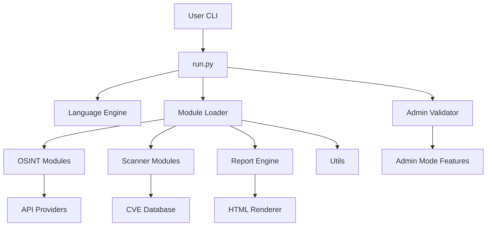

# 🌐 **PYSEC Auditor**
### **Advanced Security Intelligence, Automation & Reconnaissance Framework**

PYSEC Auditor adalah framework profesional untuk *security auditing*, OSINT, vulnerability intelligence, reporting, dan workflow automation.  
Dirancang untuk enterprise, penetration tester, red team operator, dan technical security engineers yang membutuhkan tool modern, modular, dan powerful.

---

# ⭐ **Fitur Utama**

## 🔍 **1. Reconnaissance & OSINT Engine**
- Enumerasi domain, subdomain, metadata, open ports, exposed endpoints.
- DNS map builder.
- API OSINT eksternal (Shodan, VirusTotal, Hunter.io, dll).
- Analisis risiko berbasis pola + AI-assisted optional.

## 🛡️ **2. Security Scanner Suite**
- Port & service scanner.
- HTTP probing + banner grabbing.
- CVE correlation engine (CVSS-based).
- Risk scoring otomatis (0–10).

## 📊 **3. Modern Reporting System**
- HTML responsif dan estetis.
- Severity color-coded.
- Exportable PDF melalui browser.

## 🔑 **4. Admin & Key Management**
- API key tersimpan aman di `config/keys.json`
- Admin mode:
  - Advanced scan
  - Premium features
  - Full diagnostic logs

## 🌍 **5. Multilingual Engine**
Konfigurasi dalam:
- English (`en`)
- Indonesian (`id`)
- Spanish (`es`)
- Arabic (`ar`)

Dapat ditambah via `src/language.py`.

---

# 🧱 **Project Architecture**

```
PySec-Auditor/
│── run.py
│── config/
│   ├── keys.json
│   └── admin.json
│── src/
│   ├── scanners/
│   ├── osint/
│   ├── utils/
│   ├── reports/
│   └── language.py
│── docs/
│── README.md
│── PLAYBOOK.md
│── SETUP.md
```

---

# 🏗️ **Arsitektur Framework (Diagram)**



---

# 🚀 **Quick Start**

```bash
python3 run.py --help
python3 run.py --scan target.com
python3 run.py --osint domain.com
python3 run.py --export report.html
python3 run.py --lang en
```

---

# 🔐 **Admin Mode**

Untuk menggunakan fitur premium:

```bash
python3 run.py --admin --key YOUR_ADMIN_KEY
```

Fitur admin:
- Advanced risk mapping
- API premium module
- Deep diagnostic analysis

---

# 🤝 **Contribution**

Kontribusi diperbolehkan melalui:
- module baru
- bahasa baru
- optimalisasi codebase
- design & UI/UX untuk report

---

# 📄 License
MIT.
